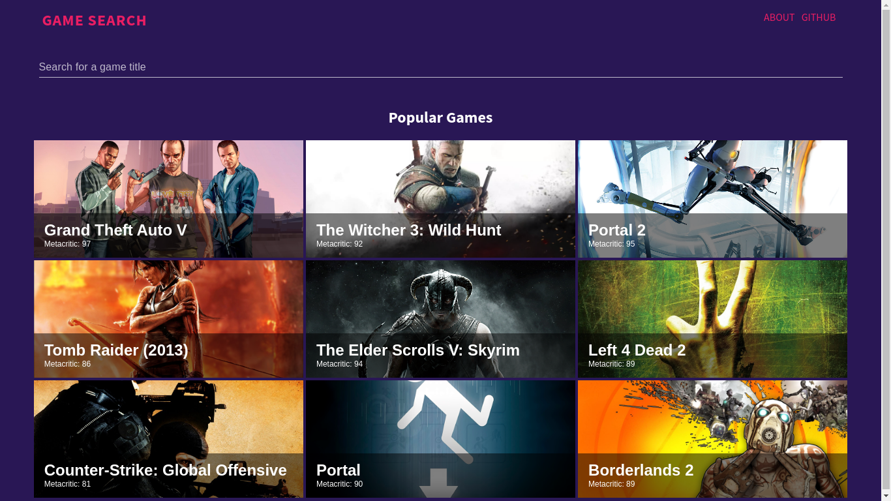
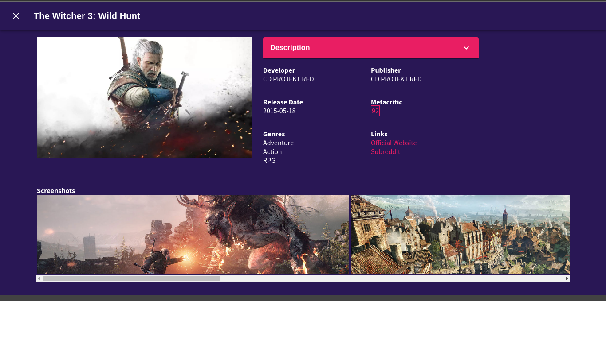
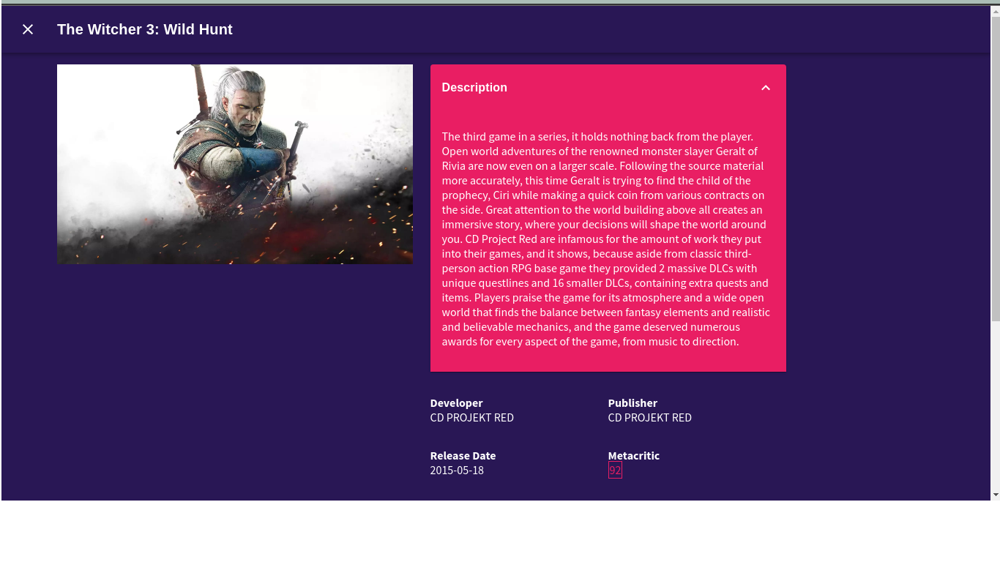
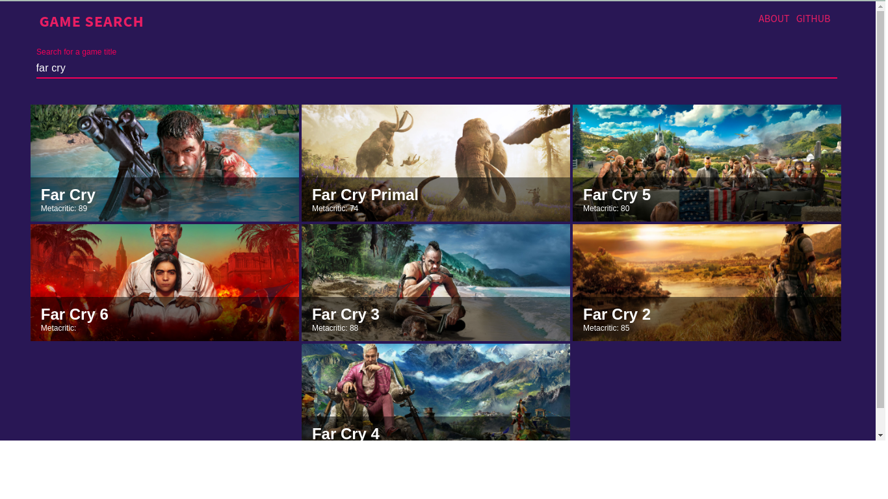
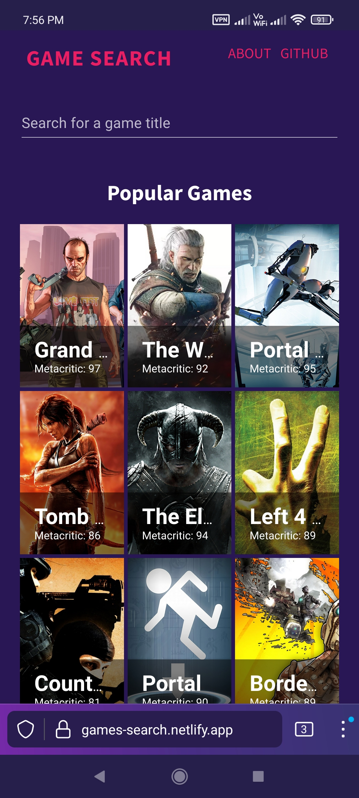
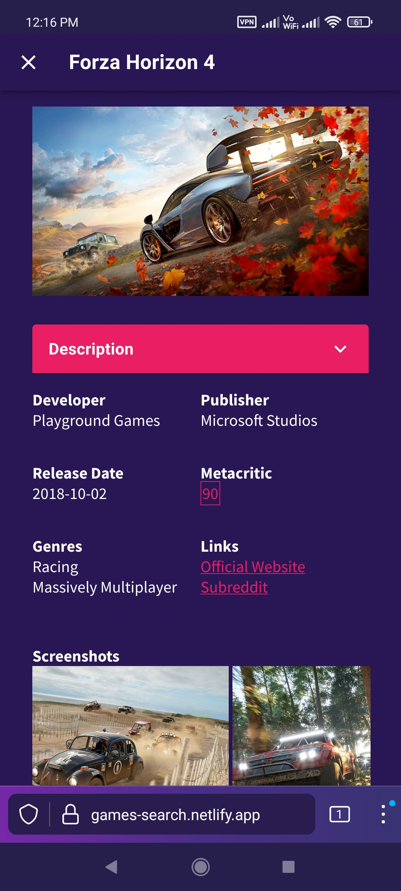

This is the repo for my react based game search application.

## Technologies Used
This is a React based web application styled using [Material-UI](https://mui.com) and the data is sourced from [RAWG's](https://rawg.io) API. It is being hosted on [Netlify](https://netlify.com).

## About
This web application lets you look up details about your favourite video games.

## Screenshots

### Desktop

|  |   |
|--------------|-----------|
|   |  | 
|   |  | 

### Mobile

|  |   |
|--------------|-----------|
|   |  | 
